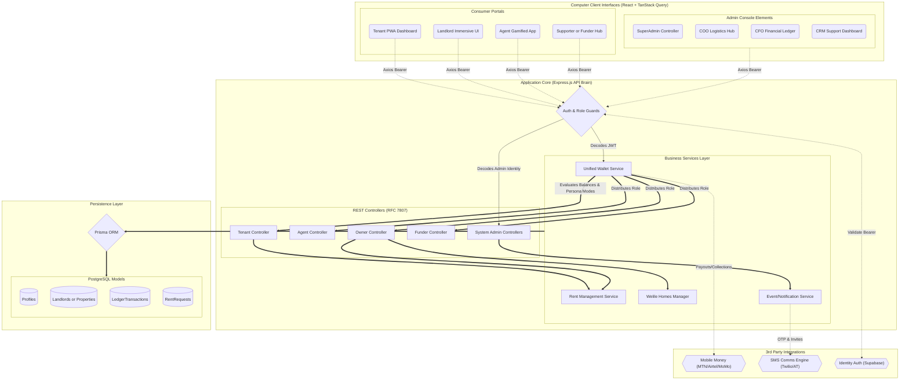

# System Architecture

This document outlines the high-level infrastructure of the platform. We follow a strict **Three-Tier Architecture** to ensure separation of concerns, massive scalability, and robust security.

## Three-Tier Architecture Line Diagram (Our Stack)

```text
┌───────────────────────────────┐
│        FRONTEND LAYER         │
│                               │
│   React (PWA / Web / Mobile)  │
│                               │
│ - User Interface              │
│ - Dashboards                  │
│ - Forms (Withdraw, Deposit)   │
└───────────────┬───────────────┘
                │  HTTPS (API Calls)
                ↓
┌───────────────────────────────┐
│        API LAYER              │
│                               │
│   Node.js (Express / NestJS)  │
│                               │
│ - Authentication (JWT)        │
│ - Business Logic              │
│ - Role Control (CFO/Ops/Agent)│
│ - Validation & Security       │
└───────────────┬───────────────┘
                │  SQL Queries
                ↓
┌───────────────────────────────┐
│        DATA LAYER             │
│                               │
│        AWS RDS (PostgreSQL)   │
│                               │
│ - Users                       │
│ - Transactions                │
│ - Wallet Balances             │
│ - Audit Logs                  │
└───────────────────────────────┘
```

## How Data Flows (Real Example)

**Scenario:** A user initiates a transaction (e.g., clicks "Withdraw")

```text
User clicks "Withdraw"
        ↓
React sends request → API
        ↓
Node.js checks:
   - Is user valid?
   - Is balance enough?
   - Is agent approved?
        ↓
API updates → AWS RDS
        ↓
Response sent back → React UI updates
```

## Why This Architecture Works

This isn’t just drawing boxes — it defines exactly where components live and how they talk to each other:

1. **Clear Separation of Concerns:** UI states remain decoupled from server processes.
2. **Controlled Data Flow:** Information and state transitions follow a strict, unidirectional path.
3. **Centralized Logic (The Brain):** The API layer is the only place where business logic actually lives, serving as the sole gatekeeper for data manipulation. 
4. **Infinite Scalability:** We can easily add completely new frontends (like a native iOS/Android application) without altering a single line of backend code.

## System Component Diagram

Below is the exhaustive architectural diagram detailing the various client portals, the Node.js API layer endpoints, and the PostgreSQL Persistence layer representing our system.


