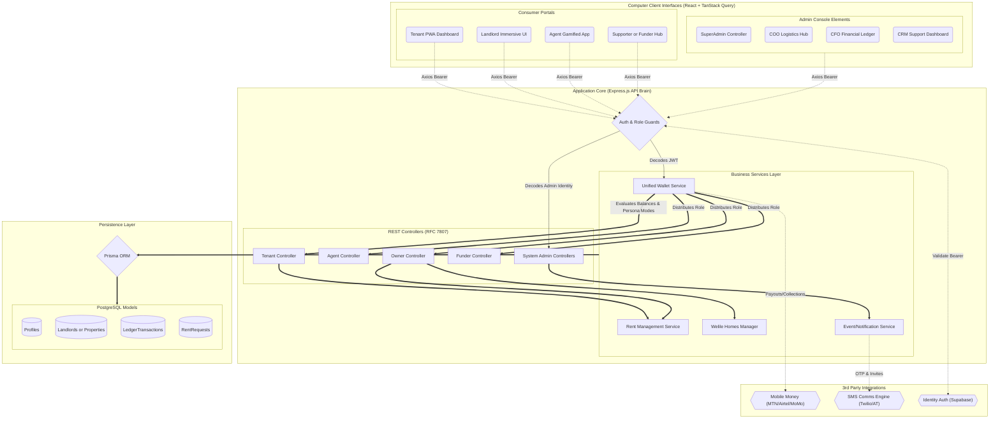

# RentFlow Insight System Architecture

This architectural blueprint outlines the entire Three-Tier structured ecosystem of the RentFlow Insight platform, capturing the interaction between client portals, the business logic layer, and the foundational database/system integrations.

## Interactive Flowchart

